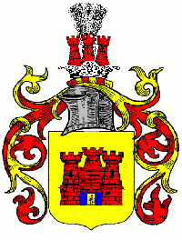
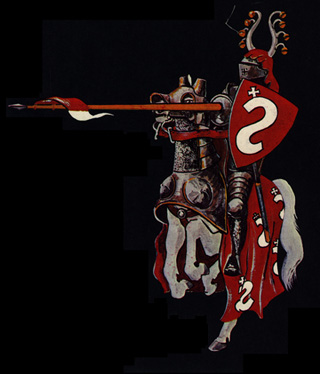
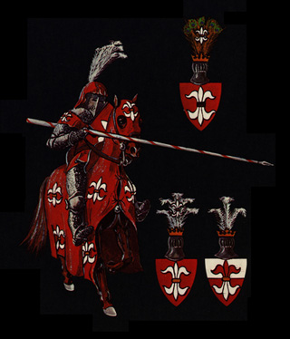

# von Zelberschwecht - Laszewski

the original being Zelberschwecht Grzymala

## Post 1

origin: https://web.archive.org/web/20060430150519/http://zelberschwecht.com/history.html

von Zelberschwecht - Laszewski see certificate by the German Emperor Wilhelm II 1887
v. Selberswech Laszewski, Marienburg, Poland, meeting hall of the Teutonic Knights.
Laszewski de Silberschwecht -reference: general Illustrated Armorial by Victor & Henry Rolland, publ J>B> Rietstap Sauveguarde Historique, 142 Rue Crequi, 142 Lyon, France

additional reference see also: http://home.foni.net/~adelsforschung/zurek05.htm best to have it translated into your language via Google or other. > AD 1400

also found references under Zylberschweg / Zelberszwecht / Zylberswech

The legend of origin of the Grzymala clan who took over the same crest goes:

Some authorities believe that this coat of arms was brought to Poland from Germany by a knight named Zylberschweg or Zelberszwecht. It is, however, one of the oldest Polish coats of arms, whose clan's war cry was Grzymal/a (for Thunder). The original homeland of this clan was the district of L/omz'a in Masovia. The coat of arms was later augmented by a man in full battle armor standing in the gate, whose left arm held a shield, whose right arm held a raised sword. This augmentation was received by Przecl/aw Grzymal/a, for his courageous defense of the city Pl/ock in 1078 against the Jatwings from Prince Wl/adisl/aw Hermann.

Subsequently the coat of arms was also abated: Prince Boleslaw Wstydliwy of Poland (1127-1179), exiled the knight Grzymal/a, owner of Gos'lice in the Palatinate of Pl/ock, on the suspicion of treacherous dealings with Prince Kazimierz of Kujaw, and as further evidence of the Prince's displeasure closed the gate in this knight's coat of arms.

A second (though positive) abatement also occurred: When the Lithuanians along with the Jatwings attacked Masovia, a Grzymal/a, owner of Zielony and Slasy, courageously stood against them, inflicted a defeat upon them and hunted them down. For which feat of arms, the coat of arms was abated around the knight and the gate, leaving only a wall with towers, where there formerly was also a rampart.

Laszewski is a direct connection to v. Silberschwecht
Concordance of polonisierter German aristocracy names in west Prussia starting from 1400

German surname before the polish takeover v. Silberschwecht Polish name after 1500 Laszewski
see the the defeat of the Teutonic knights at Grunwald/Tannenberg (1410):
The number of the Teutonic Knights never exceeded a thousand, but the whole country was organized in a military manner, and with the constant arrival of new crusaders the order was able to hold its own among its neighbors, especially the inhabitants of Lithuania, who were of the same race as the natives of Prussia and, like them, pagans. In the battle of Rudau (1307) the Lithuanians were driven back, and they were converted only some years later, with their grand duke, Jagellon, who embraced Christianity when he married the heiress of the Kingdom of Poland (1386). With this event, which put an end to paganism in that section of Europe, the Teutonic Knights lost their raison d'être. Thenceforth their history consists of incessant conflicts with the kings of Poland. Jagellon inflicted on them the defeat of Tannenberg (1410), which cost them 600 knights and ruined their finances, in order to repair which the order was obliged to have recourse to exactions, which aroused the native nobility and the towns and provided the Poles with an opportunity to interfere against the order. A fresh war cost the order half its territory and the remaining half was only held under the suzerainty of the King of Poland (Treaty of Thorn, 1466).

This means v. Zelberschwecht or v. Silberchwecht and Laszcwski are the same.

Laszewski comes from from the Estate LASZEWO, ski means from, so LASZEWSKI means from Laszewo. ski is the polish nobel version of the German v. or von before the family name. (Pictures and map soon to come) also Lascewski, Laczewski.

This means anyone with the name Laszewski is a direct descendant from the knight Silberschwecht, with the various dialect different pronunciation came up thus also the von Zelberschwecht.

Before 1400 it was v. Silberschwecht now von and I will need to learn the difference between the 2 versions.

There is a direct relationship between Grzymala since that was the battle cry of the Selberschwecht knight and his clan was "Grzymala" the direct translation of Grzymala is Thunder in English.